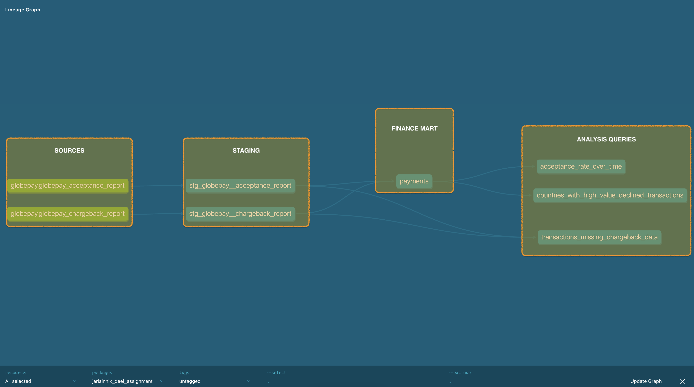

# Deel Analytics Engineering Assignment

## Notes

I have setup a bigquery account, installed dbt-core locally and connected it via service-account.
Then I uploaded the CSV files into automatic schema finding tables in a `deel_data` dataset in Bigquery.
After that it was just dbt work on modeling the data and going back and forth to bigquery for query analysis. I also used the Looker Studio for a minor dashboard.

I struggled with the initial setup due to git account problems and missing deploy keys. Also, setting up dbt using pyenv took me some time.
After the setup, and provided I had no distractions the task was fun and productive.

## Preliminary data exploration

From a high level I have identified 2 tables one with transactions and another mapping table to refer to wether or not those transactions were of type chargeback.
Observing the acceptance table I have found that we have data spanning over 6 months, the `external_ref` column is unique and there are 5430 records.

Also I was able to identify that the global acceptance rate for the transaction was around 70%. There is data for 6 different countries. The transaction amounts span from as low as $1k to $180k for a single transaction.

[Preliminary analysis query](analyses/preliminary_exploration.sql)

## Summary of Model Architecture

I was provided with 2 source tables: `globepay_acceptance_report` and `globepay_chargeback_report`. Both tables have their unique key in the column `external_ref` and they join 1=1 to each other on that same column. Both tables were given simple base models for renaming columns for better readibility.

On the transformation proccess I transposed the JSON column in `globepay_acceptance_report` called `rates` into its own columns. The `rates` JSON has currency conversion rates for 7 currencies.
For better usability I joined both tables and created the final [`payments`](models/marts/finance/payments.sql) table. This table can serve as a base for any analysis we want to discover.

## Lineage Graph

## Part 2

1. What is the acceptance rate over time?
     Results in [Dashboard](assets/Looker_Studio_Reporting_-_22_02_24,_22_40.pdf)
2. List the countries where the amount of declined transactions went over $25M
     Results in [Dashboard](assets/Looker_Studio_Reporting_-_22_02_24,_22_40.pdf)
3. Which transactions are missing chargeback data?
     **None**. I did not find any missing records in either tables when joined on `external_ref` column.
